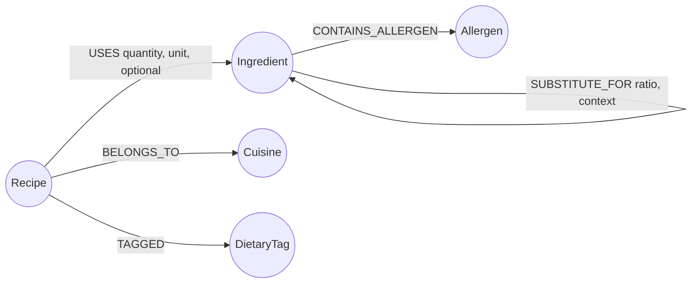
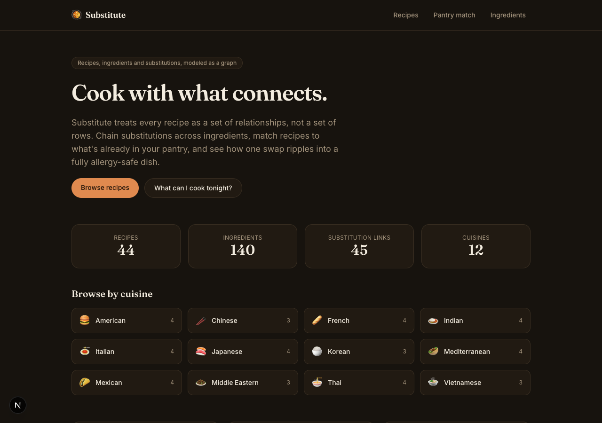
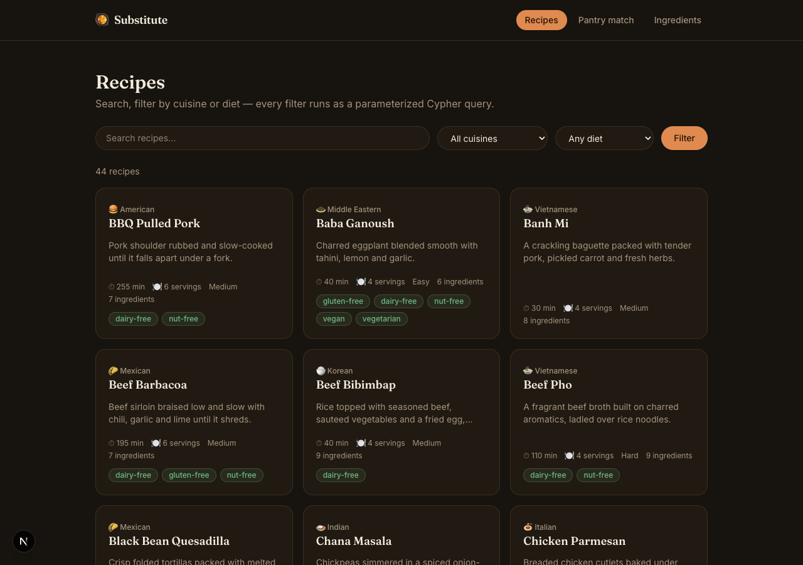
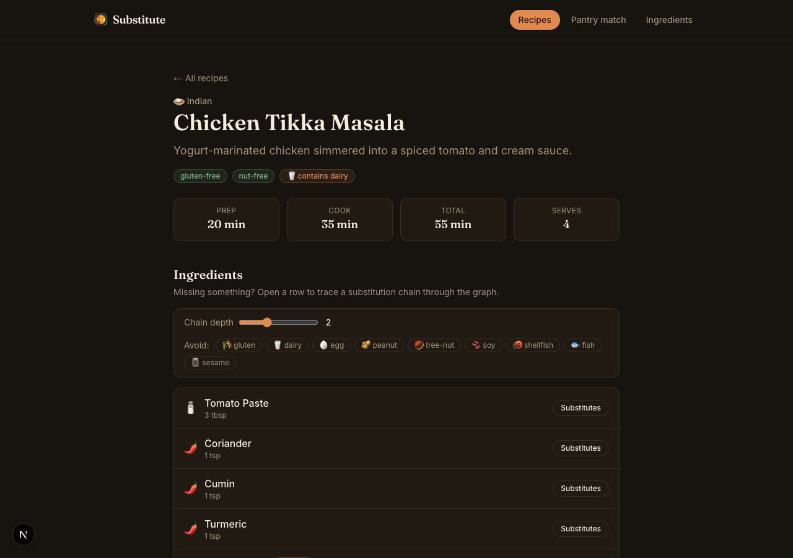
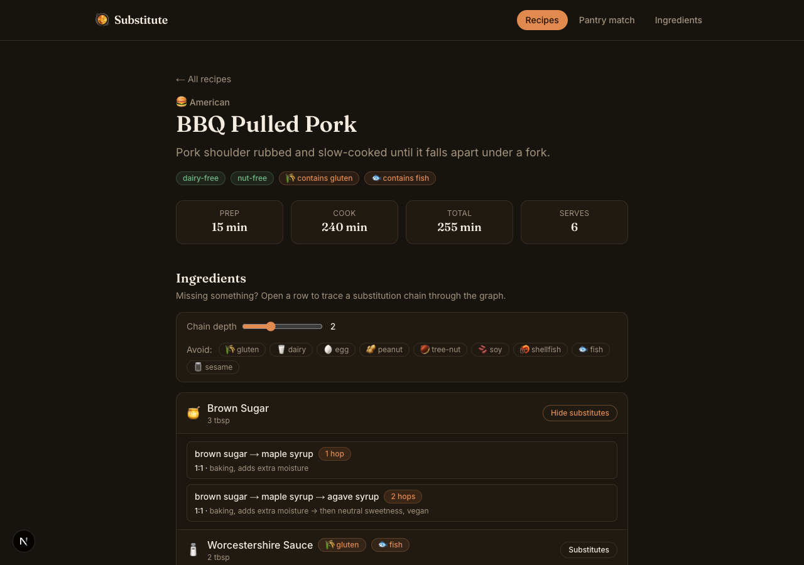
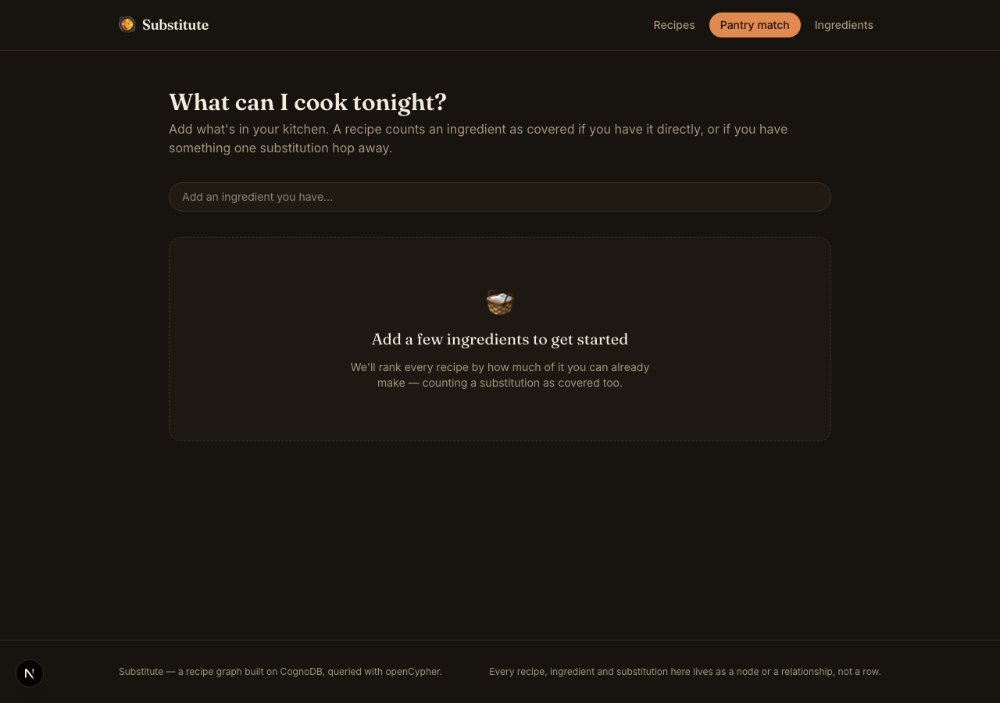
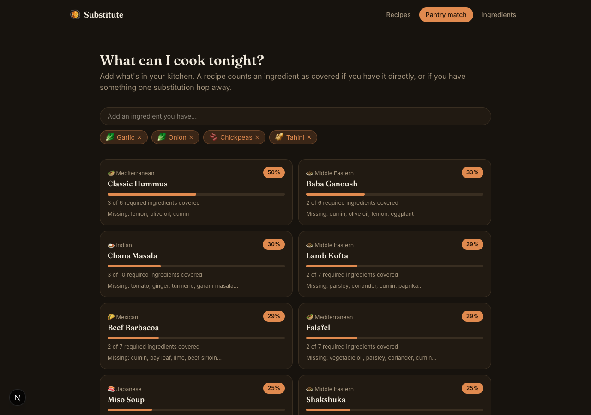
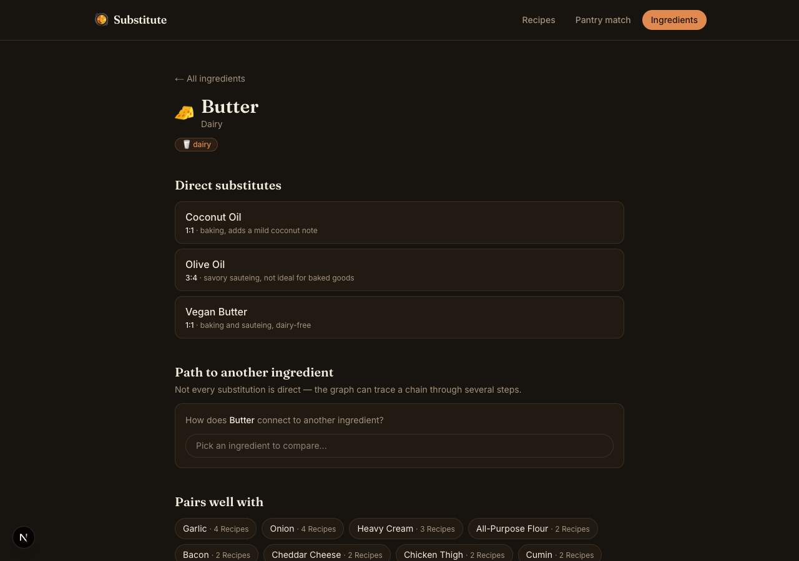
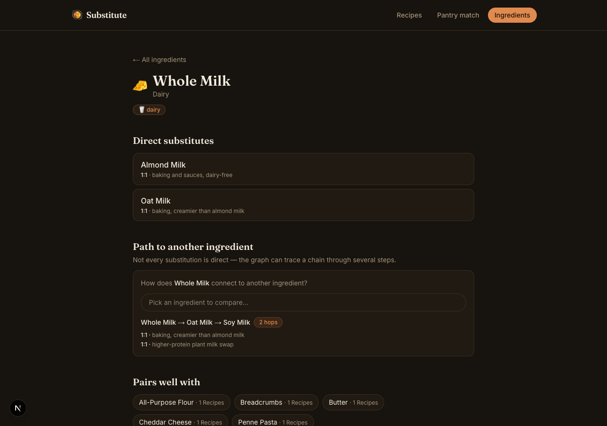

# Substitute

**Live demo:** [cognodb-recipe-graph.vercel.app](https://cognodb-recipe-graph.vercel.app) —
backed by a live CognoDB Cloud instance.

A recipe and ingredient explorer where the interesting feature — tracing a chain of
substitutions to work around what's missing from your kitchen or what you're allergic to —
only makes sense because the data is a graph. Built on **CognoDB** (openCypher over Bolt) with
Next.js and the official Neo4j JavaScript driver.

- **Recipes** — 44 recipes across 12 cuisines, searchable and filterable by diet.
- **Substitution chains** — every ingredient can chain through multiple substitutions
  (`butter → vegan butter → coconut oil`), with an allergen-avoidance filter applied live.
- **Pantry match** — tell it what you have, it ranks recipes by coverage, counting an
  ingredient as covered even if you only have something one substitution hop away from it.
- **Path finder** — pick any two ingredients and see the shortest chain of substitutions
  connecting them, if one exists.

## Why a graph database?

Recipes, ingredients, substitutions and allergens are naturally a web of relationships, and the
questions worth asking about that web are multi-hop questions:

- *"If I don't have butter, and I'm also avoiding tree nuts, what can I use — even if it takes
  two substitutions to get there?"* In a relational schema, an `ingredient_substitutes` table
  answers the one-hop case fine. The moment you want chains of arbitrary depth (`butter → vegan
  butter → coconut oil`), you're writing a recursive CTE, and it gets worse the moment you also
  want to filter the far end of that chain by a join against an `allergens` table. In Cypher this
  is one pattern: `(start)-[:SUBSTITUTE_FOR*1..4]->(sub)`, with the hop count as a first-class
  part of the query instead of a recursion depth counter you maintain by hand.
- *"What's the shortest path between whole milk and soy milk?"* — a graph database has
  `shortestPath()` built in. A relational database has no native concept of a path at all; you'd
  need to materialize the substitution graph into an adjacency table and run a
  breadth-first search in application code, or lean on vendor-specific recursive query
  extensions that get unreadable fast.
- *"Which recipes can I make if I own a substitute for an ingredient, not the ingredient
  itself?"* This is the pantry-matching feature, and it's really asking the graph: for each
  required ingredient, is it in my pantry directly, **or** is it one `SUBSTITUTE_FOR` hop from
  something in my pantry? That's a single pattern match per ingredient in Cypher
  (`getSubstitutes`/`matchRecipesToPantry` in [`src/lib/queries.ts`](src/lib/queries.ts)) instead
  of a self-join plus a `UNION` plus a lot of hoping the query planner does something sane with it.

None of this is impossible in SQL — recursive CTEs exist. But the schema stops matching the
shape of the questions the moment substitutions can chain, and every new relationship type
(allergens, dietary tags, "pairs well with") is another join instead of another edge label. A
graph model keeps the query as simple as the question.

## Data model



| Node | Key properties |
| --- | --- |
| `Recipe` | `id`, `name`, `description`, `prepMinutes`, `cookMinutes`, `servings`, `difficulty`, `instructions[]` |
| `Ingredient` | `id`, `name`, `category` |
| `Cuisine` | `name` |
| `DietaryTag` | `name` (vegan, gluten-free, ...) |
| `Allergen` | `name` (dairy, tree-nut, ...) |

| Relationship | Direction | Properties |
| --- | --- | --- |
| `USES` | `Recipe → Ingredient` | `quantity`, `unit`, `optional` |
| `BELONGS_TO` | `Recipe → Cuisine` | — |
| `TAGGED` | `Recipe → DietaryTag` | — |
| `CONTAINS_ALLERGEN` | `Ingredient → Allergen` | — |
| `SUBSTITUTE_FOR` | `Ingredient → Ingredient` | `ratio`, `context` — read as "the source ingredient can be replaced by the target" |

The seed data ([`src/data/seed-data.ts`](src/data/seed-data.ts)) has 44 recipes, 140 ingredients,
12 cuisines, 7 dietary tags, 9 allergens and 45 substitution edges — small enough to read in one
sitting, large enough that the multi-hop queries return real, varied chains rather than one
contrived example.

## Tech stack

- **Next.js 16** (App Router, TypeScript) — server components fetch directly from CognoDB for
  page loads; a handful of API routes back the interactive client widgets (pantry matcher,
  substitution explorer, path finder).
- **neo4j-driver** (official JS driver) — every query in [`src/lib/queries.ts`](src/lib/queries.ts)
  goes through `runQuery()` in [`src/lib/db.ts`](src/lib/db.ts), which always passes parameters
  as a separate object, never string-concatenates Cypher.
- **Tailwind CSS v4** for styling.
- No ORM, no query builder — Cypher is close enough to the mental model of the data that adding
  one would just be indirection.

## Running it yourself

### 1. Create a CognoDB Cloud instance

1. Sign up at [console.cognodb.com/signup](https://console.cognodb.com/signup) — no credit card
   needed for the free tier.
2. Create a free **c0** instance and pick a region. It provisions in under a minute.
3. Copy the connection URI (`bolt+s://<instance-id>.databases.cognodb.cloud`) and the generated
   password for the `cognodb` user — the password is shown once.

### 2. Configure environment variables

```bash
cp .env.example .env.local
```

Fill in the three values:

```
COGNODB_URI=bolt+s://<instance-id>.databases.cognodb.cloud
COGNODB_USER=cognodb
COGNODB_PASSWORD=<the password CognoDB showed you>
```

`.env.local` is gitignored — nothing in this repo ever hardcodes credentials.

### 3. Install, seed, run

```bash
npm install
npm run seed   # wipes and reloads the graph from src/data/seed-data.ts
npm run dev
```

Open [http://localhost:3000](http://localhost:3000). If the database is unreachable — wrong
credentials, a paused instance, or `npm run seed` was never run — every page shows a specific,
actionable error instead of crashing (see `src/app/error.tsx` and `src/components/DbErrorNotice.tsx`).

`npm run seed` is idempotent: it clears the graph and reloads it from the same source data, so
re-running it after a schema tweak is always safe.

### Local testing without CognoDB Cloud

CognoDB speaks the same Bolt/openCypher protocol as Neo4j, so any Bolt-compatible server works
for local development — this project was developed and tested against a local
`brew install neo4j` instance before pointing at a real CognoDB Cloud instance, with no code
changes required beyond the connection URI.

## The main queries

All queries live in [`src/lib/queries.ts`](src/lib/queries.ts) and are called from server
components or API routes — never from the browser directly, and never with interpolated strings.

**Multi-hop substitution chain** (`getSubstitutes`) — the core feature. Finds every ingredient
reachable through a chain of substitutions up to a configurable depth, keeps only the shortest
path to each one, and optionally filters out any result that carries an allergen you're avoiding:

```cypher
MATCH p = shortestPath(
  (start:Ingredient {id: $ingredientId})-[:SUBSTITUTE_FOR*1..4]->(sub:Ingredient)
)
WHERE sub.id <> $ingredientId
WITH sub, length(p) AS hops,
     [n IN nodes(p) | n.name] AS path,
     [rel IN relationships(p) | {ratio: rel.ratio, context: rel.context}] AS steps
OPTIONAL MATCH (sub)-[:CONTAINS_ALLERGEN]->(al:Allergen)
WITH sub, hops, path, steps, collect(DISTINCT al.name) AS allergens
WHERE size($avoidAllergens) = 0 OR NONE(a IN allergens WHERE a IN $avoidAllergens)
RETURN sub.id AS id, sub.name AS name, hops, path, steps, allergens
ORDER BY hops ASC
```

*(The `1..4` hop bound is the one part of this query that can't be parameterized — Cypher
requires variable-length hop counts to be literals in the query text. `getSubstitutes` clamps the
caller-supplied value to an integer between 1 and 5 before it ever reaches the query string, so
nothing user-controlled is concatenated in.)*

**Shortest path between two arbitrary ingredients** (`findSubstitutionPath`) — the "how does
whole milk connect to soy milk" query:

```cypher
MATCH (a:Ingredient {id: $fromId}), (b:Ingredient {id: $toId})
MATCH p = shortestPath((a)-[:SUBSTITUTE_FOR*..6]-(b))
RETURN length(p) AS hops,
       [n IN nodes(p) | {id: n.id, name: n.name}] AS path,
       [rel IN relationships(p) | {ratio: rel.ratio, context: rel.context}] AS steps
```

**Pantry match** (`matchRecipesToPantry`) — the query a relational database would find genuinely
awkward. For every recipe, each required ingredient is "covered" if it's directly in the
pantry, *or* if there's a substitution edge from it to something in the pantry — a graph
reachability check embedded directly in a `WHERE`/pattern-comprehension clause, not a second
query bolted on afterward:

```cypher
MATCH (r:Recipe)-[u:USES]->(i:Ingredient)
WHERE u.optional = false
WITH r, i,
     i.id IN $haveIds AS direct,
     size([(i)-[:SUBSTITUTE_FOR]->(alt:Ingredient) WHERE alt.id IN $haveIds | alt]) > 0 AS viaSub
WITH r, collect({ingredient: i, covered: direct OR viaSub, direct: direct}) AS lines
WITH r, lines, size(lines) AS totalRequired,
     size([l IN lines WHERE l.covered]) AS coveredCount
WHERE coveredCount > 0
MATCH (r)-[:BELONGS_TO]->(c:Cuisine)
RETURN r.id AS id, r.name AS name, c.name AS cuisine,
       totalRequired, coveredCount, toFloat(coveredCount) / totalRequired AS coverage,
       [l IN lines WHERE NOT l.covered | l.ingredient.name] AS missingIngredients
ORDER BY coverage DESC
```

Everything else — recipe search/filter, ingredient co-occurrence ("pairs well with"), recipe and
ingredient detail lookups — is in the same file and follows the same pattern: parameters passed
through the driver, never interpolated into the query string.

## Screenshots

| | |
| --- | --- |
|  |  |
|  |  |
|  |  |
|  |  |

## Project structure

```
src/
  app/
    page.tsx                    home — stats + cuisine browser
    recipes/                    search/filter list + detail page
    ingredients/                list + detail page (substitutes, path finder, pairings)
    pantry/                     pantry-to-recipe matcher
    api/                        route handlers backing the client-side widgets
    error.tsx, loading.tsx      graceful DB-down and loading states
  components/                   RecipeCard, SubstitutionExplorer, PantryMatcher, ...
  data/seed-data.ts             all seed recipes, ingredients, substitutions
  lib/
    db.ts                       driver singleton, parameterized query runner
    queries.ts                  every Cypher query the app runs
    types.ts
scripts/seed.ts                 loads seed-data.ts into CognoDB
```

## Deployment

Live at **[cognodb-recipe-graph.vercel.app](https://cognodb-recipe-graph.vercel.app)** on
Vercel's free Hobby tier, reading `COGNODB_URI` / `COGNODB_USER` / `COGNODB_PASSWORD` from
Vercel's encrypted Production environment variables (set via `vercel env add`, never committed)
and pointed at a real CognoDB Cloud `c0` instance seeded with `npm run seed`.

To deploy your own copy: push this repo to GitHub, import it at
[vercel.com/new](https://vercel.com/new), add the three environment variables above in Project →
Settings → Environment Variables, and deploy. Vercel's GitHub integration needs to be authorized
interactively from the dashboard (Project → Settings → Git) to get auto-deploys on push — this
repo's Vercel project was created via the CLI and isn't linked to GitHub for CI yet, so
redeploys until then are `npx vercel --prod` from a local checkout.

## Error handling

If CognoDB is unreachable — instance paused, wrong credentials, network issue — the driver call
throws a `DatabaseUnavailableError` ([`src/lib/db.ts`](src/lib/db.ts)). Server-rendered pages
catch it via `src/app/error.tsx` and show a specific "can't reach CognoDB" panel with the exact
checklist to fix it; API routes catch it in [`src/lib/api-error.ts`](src/lib/api-error.ts) and
return a `503` with the same message, which the client widgets (pantry matcher, substitution
explorer) render inline instead of failing silently.
